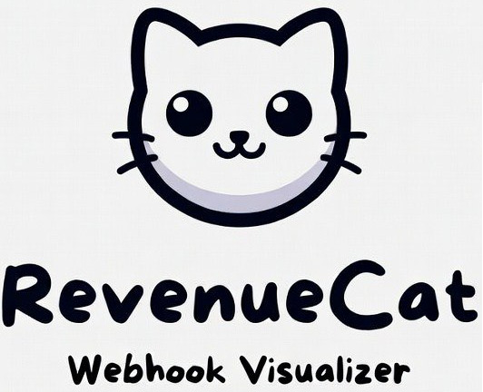
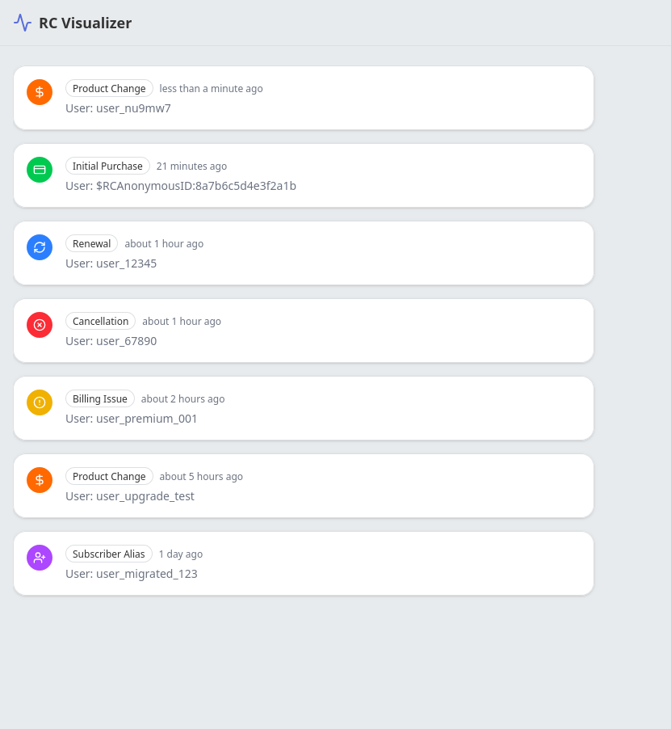

<p align="center">
  
</p>

# RevenueCat Webhook Visualizer

A real-time dashboard for visualizing RevenueCat webhook events. Transforms raw subscription data into a human-readable, chronological timeline for debugging and auditing.


<table>
  <tr>
    <td></td>
    <td></td>
  </tr>
</table>

## Features

- **Real-time Timeline** - Events appear instantly via Supabase Realtime
- **Event Detail Inspector** - View full JSON payload in a side drawer
- **Human-readable Labels** - Raw event types converted to friendly names
- **Loading States** - Skeleton loaders while fetching data
- **Mock Mode** - Develop without a Supabase connection

## Quick Start

### Development with Mock Data

```bash
npm install
npm run dev:mock
```

### Development with Supabase

1. Create a `.env` file:

```bash
VITE_SUPABASE_URL=https://your-project.supabase.co
VITE_SUPABASE_PUBLISHABLE_DEFAULT_KEY=your-anon-key
```

2. Run the database migration in Supabase SQL Editor:

```sql
CREATE TABLE webhook_events (
  id UUID PRIMARY KEY DEFAULT gen_random_uuid(),
  created_at TIMESTAMPTZ DEFAULT timezone('utc'::text, now()) NOT NULL,
  app_user_id TEXT NOT NULL,
  type TEXT NOT NULL,
  original_payload JSONB NOT NULL
);

ALTER PUBLICATION supabase_realtime ADD TABLE webhook_events;
```

3. Start the dev server:

```bash
npm run dev
```

## Deploying the Webhook

1. Deploy the Edge Function:

```bash
npx supabase login
npx supabase functions deploy rc-webhook
```

2. Set the webhook secret in Supabase Dashboard → Edge Functions → Secrets:

```
WEBHOOK_SECRET=your-secret-here
```

3. Configure RevenueCat to send webhooks to:

```
https://your-project.supabase.co/functions/v1/rc-webhook
```

With header: `Authorization: Bearer your-secret-here`

## Supported Event Types

| Event | Description |
|-------|-------------|
| `INITIAL_PURCHASE` | New subscription started |
| `RENEWAL` | Subscription renewed |
| `CANCELLATION` | Subscription cancelled |
| `BILLING_ISSUE` | Payment failed |
| `PRODUCT_CHANGE` | Plan upgrade/downgrade |
| `SUBSCRIBER_ALIAS` | User ID linked |

## Tech Stack

- **Frontend:** React 18, TypeScript, Vite
- **UI:** Tailwind CSS, Shadcn/ui
- **State:** TanStack React Query
- **Backend:** Supabase (PostgreSQL, Edge Functions, Realtime)
- **Icons:** Lucide React
- **Dates:** date-fns

## Scripts

| Command | Description |
|---------|-------------|
| `npm run dev` | Start with Supabase |
| `npm run dev:mock` | Start with mock data |
| `npm run build` | Production build |
| `npm run lint` | Run ESLint |
| `npm run preview` | Preview production build |

## Roadmap

### 🔍 User Timeline Filter
Filter the timeline to view webhook events for a specific `app_user_id`. Useful for debugging individual subscriber issues.

- Search/filter input in the header
- URL parameter support (`?user=user_123`)
- Clear filter button to return to all events

### 📱 Telegram Notifications
Push notifications to Telegram for configurable webhook events. Get alerted in real-time when important subscription events occur.

- Connect Telegram bot via settings panel
- Configure which event types trigger notifications (e.g., `CANCELLATION`, `BILLING_ISSUE`)
- Optional: filter notifications by user ID patterns
- Supabase Edge Function to send Telegram messages

## License

MIT

